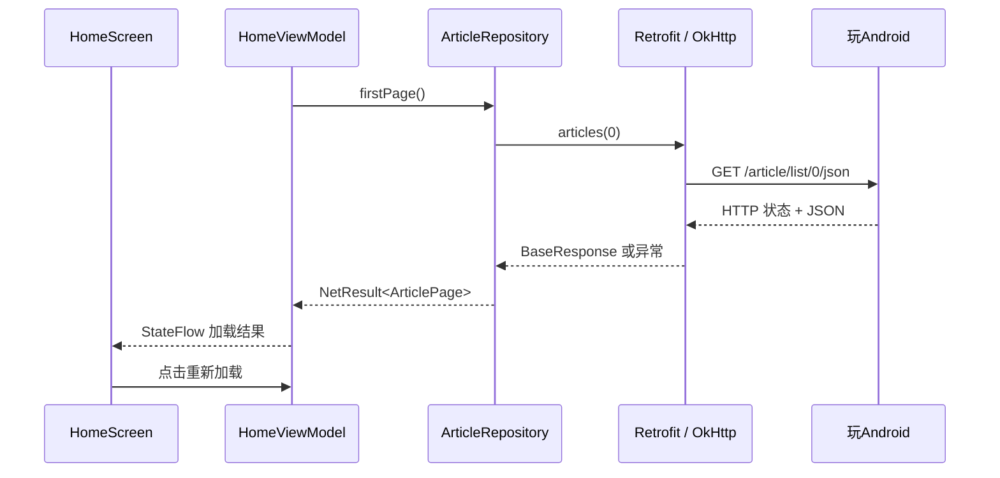

# S2 · 网络层与错误处理（iOS 视角）

本课目标：沿着 UI → ViewModel → Repository → Retrofit/OkHttp 发出真实请求，把 JSON 转成 Kotlin 对象，正确区分失败，并能在页面重试。

先在 Android Studio 打开 `WanReader/`，Sync 后运行。首页会自动请求文章，显示数量和第一条标题；Logcat 搜索 `tag:WanNetwork` 查看前三条文章的 ID 和标题。底部三 Tab 沿用 S1。本课尚未做完整列表、分页和登录。

## 1. 从 URLSession 的经验开始

| Android 本课组件 | 职责 | iOS 近似对照 |
|---|---|---|
| OkHttpClient | 连接复用、TLS、超时、HTTP 执行 | URLSession + URLSessionConfiguration |
| Retrofit | 将接口声明转换为请求，衔接协程和转换器 | 自己封装的类型化 APIClient |
| kotlinx.serialization | JSON 与 Kotlin DTO 转换 | Codable + JSONDecoder |
| WanApi | 声明路径、参数、返回类型 | API protocol / Endpoint 定义 |
| ArticleRepository | 解开业务响应、转换模型，屏蔽来源 | Repository |
| viewModelScope | 请求随 ViewModel 清理而取消 | ViewModel 持有 Task 并管理取消 |
| StateFlow | 保存最新 UI 状态 | 持有当前值的响应式状态；并非与 Combine 完全等价 |

Retrofit 不是另一套 HTTP 引擎。它根据接口注解构造请求，实际网络交给 OkHttp，响应体交给转换器。Hilt 则负责组装和复用这些对象。



## 2. 本课代码导航

所有 Kotlin 路径相对于 `app/src/main/java/com/wb/wanreader/`：

| 文件 | 阅读时关注的问题 |
|---|---|
| `data/network/WanApi.kt` | 注解怎样把 page 拼进路径？ |
| `data/network/BaseResponse.kt` | HTTP 成功为什么还要看 errorCode？ |
| `data/network/dto/ArticleDto.kt` | 哪些字段必填，哪些允许缺失或 null？ |
| `data/network/NetworkClient.kt` | 超时、公共头、日志与 JSON 配置在哪里统一？ |
| `data/network/NetResult.kt` | 什么是失败，什么必须继续抛出？ |
| `data/model/ArticlePage.kt` | 页面使用的对象为什么不带 Serializable？ |
| `data/ArticleRepository.kt` | 数据字段如何转换成 App 的语言？ |
| `di/NetworkModule.kt` | 如何复用同一套客户端和连接池？ |
| `ui/home/HomeViewModel.kt` | 请求由谁发起，何时取消，如何防重复？ |
| `ui/home/HomeScreen.kt` | 怎样观察状态，而不是在重组时发请求？ |

S2 直接使用 Repository，无须为了分层而增加只转发一次调用的 UseCase；领域层按业务复杂度引入。单模块内的包不会自动强制依赖方向。

## 3. 工程配置：每一项为什么存在

本课版本固定在 `gradle/libs.versions.toml`：Retrofit/转换器 2.11.0，OkHttp/日志/MockWebServer 4.12.0，serialization-json 1.8.1，Coroutines 1.10.2。它们是本课选用的组合，不代表最新版本，也不由 Compose BOM 管理。

serialization 有两部分：

- **编译器插件** `org.jetbrains.kotlin.plugin.serialization`：版本跟随 Kotlin，本工程 2.3.20，生成 DTO 的序列化代码。
- **运行时库** `kotlinx-serialization-json`：独立版本，本课 1.8.1，负责实际 JSON 编解码。

只加库不加插件可能出现找不到 serializer。序列化由 Kotlin 插件处理，Hilt 的代码生成由 KSP 处理，两者职责不同。

Manifest 新增 `android.permission.INTERNET`。这是普通权限，安装时授予，不需要运行时申请弹窗；不要套用相机和定位权限的流程。

`buildFeatures.buildConfig = true` 生成 `BuildConfig.DEBUG`，用于控制日志。编译 release 时 HTTP 日志级别为 NONE，文章摘要日志也不会输出。

## 4. API 契约与 JSON 建模

官方建议 Base URL 用 `https://wanandroid.com/`。Retrofit 的 Base URL 要以 `/` 结尾；相对路径声明如下：

```kotlin
@GET("article/list/{page}/json")
suspend fun articles(@Path("page") page: Int): BaseResponse<ArticlePageDto>
```

本课请求 page=0，响应 `curPage` 通常为 1，不能把这两个索引当成同一个值。后续分页要统一转换规则。暂不传 `page_size`，使用服务默认大小。

业务响应可以抽象为：

```json
{
  "errorCode": 0,
  "errorMsg": "",
  "data": {
    "curPage": 1,
    "over": false,
    "datas": [{"id": 7, "title": "文章标题", "link": "https://example.com", "author": null}]
  }
}
```

这段是精简的契约示例，不是完整生产响应。本课只声明需要的字段；`ignoreUnknownKeys = true` 容忍服务端增加字段，但不会自动修复类型错误。

重点理解三种定义：

```kotlin
val title: String           // 必须存在且不为 null
val errorMsg: String = ""   // 缺失可用默认值；显式 null 仍非法
val author: String? = null  // 缺失和显式 null 都可接受
```

`errorCode` 不给默认 0，否则服务返回缺字段的错误 JSON 时可能被当成成功。文章 ID、标题、链接保留必填约束；作者和分享者允许为空。Repository 依次选择非空作者、分享者、最后显示“佚名”。

DTO 是外部传输契约；`Article`/`ArticlePage` 是 App 使用的模型，允许字段名和展示语义不同。这样将来换接口、接缓存，不必把服务端的 `datas` 等命名传播到 UI。

## 5. 错误处理：HTTP 200 不是业务成功

| 情况 | NetError | 本课行为 |
|---|---|---|
| HTTP 非 2xx，例如 503 | Http(code) | 提示服务异常，可手动重试 |
| HTTP 200，但 errorCode 非 0 | Business(code, message) | 保留业务码；-1001 提示登录失效 |
| DNS、连接、读超时等 IOException | Network | 提示检查网络 |
| JSON 类型错误或缺必填字段 | Decode | 提示数据格式异常 |
| errorCode=0，但 data=null | EmptyData | 认为查询协议不完整 |
| data 正常、datas=[] | 成功 | 显示暂无文章 |
| 协程取消 | 不转换为 NetError | 继续抛出 CancellationException |

`apiCall` 只捕获约定的网络/解析异常。没有用 `catch (Exception)` 将程序错误全部伪装成断网；也没有盲目 `runCatching`，因为它会捕获取消异常。

本课的 `apiCall<T : Any>` 专门用于需要非空 data 的查询。以后收藏等成功可返回空 data 的写接口，需要另定义成功契约，不能直接照搬这个约束。

S4 才实现登录跳转和 Cookie 会话；本课遇到 -1001 只分类和提示，不清理凭证、不自动重试登录。

## 6. 协程、线程与请求生命周期

`suspend` 不等于自动切到后台线程。Retrofit 的 suspend 适配通过 OkHttp 异步执行请求，因此这里可以在 `viewModelScope.launch` 中安全调用，没必要额外包 `withContext(IO)`。

如果换成阻塞的 `Call.execute()`、文件读写等，数据层必须负责切到合适的 Dispatcher。同步阻塞网络放在主线程会导致异常或卡顿。重 CPU 的数据转换也应单独调度；本课只映射一页小数据。

`HomeViewModel` 在 init 请求一次，按钮触发重新加载；请求进行中用 Job 判重，UI 同时禁用按钮。请求归 ViewModel 管理，旋转屏幕通常不会销毁它；真正清理 ViewModel 会取消协程，并传递给 Retrofit 请求。

`collectAsStateWithLifecycle()` 在页面活跃时收集状态，但它停止收集并不等于自动取消 ViewModel 的请求。本课切换 Tab 不承诺取消请求。StateFlow 的深入使用和 ViewModel 测试留到 S3。

## 7. 拦截器与日志

公共拦截器为每个请求设置 `Accept: application/json`，表示客户端期望 JSON。GET 没有请求体，不必乱加 Content-Type。将来只有后端明确约定版本号、渠道等参数时才扩展，不发送伪造设备标识。

当前 HTTP 日志使用 BASIC，仅记录请求/响应摘要；额外对 Cookie、Set-Cookie、Authorization 做 header 脱敏。注意 header 脱敏不能处理 URL 查询参数和请求体：未来登录和搜索接口也要审查日志策略，不能直接全局开启 BODY。

本课两个 Logcat 标签：

- `WanHttp`：HTTP 请求与响应摘要，用于判断是否真的发出请求。
- `WanNetwork`：经过解析和业务判断后的结果，成功时最多打印前三条公开文章的 ID、标题。

OkHttpClient 由单例 WanApi 持有，通过 Hilt 复用。不要每次点击按钮 new 一个客户端，否则连接池和线程池也会重复创建。

## 8. 常见坑与排查顺序

1. **明文流量被拒绝**：本工程明确禁止 cleartext。检查是不是写了 `http://`，优先修正 HTTPS；不要为绕过错误全局放开明文。若未来确有开发域名必须 HTTP，应限定 debug 配置和目标域名。
2. **JSON 解析失败**：从字段路径看实际值是缺失、null 还是类型不匹配。`ignoreUnknownKeys` 只解决新增未知字段，不能让所有缺字段自动成功。
3. **请求一直失败**：看 WanHttp 是否有响应。无响应查设备网络/DNS/代理；有 HTTP 错误查状态；HTTP 200 则查业务码和解析。开发电脑能 curl 成功，不代表手机也能联网。
4. **Gradle 下载失败**：构建网络与 App 网络是两件事。构建依赖本机仓库/代理；App 请求依赖设备网络。不要通过改 App 的 TLS 校验解决 Gradle 下载问题。
5. **重组重复请求**：不要直接在 Composable 函数体调用网络。Compose 可以反复执行函数体；本课由 ViewModel init 和用户事件触发。
6. **取消后弹错误**：检查是否捕获并吞掉 CancellationException。取消是生命周期行为，通常不应展示“请求失败”。

## 9. 自动化验证与阅读练习

在 `WanReader/` 下运行：

```bash
./gradlew :app:testDebugUnitTest --tests '*ArticleRepositoryTest'
./gradlew :app:assembleDebug :app:lintDebug
```

测试文件：`app/src/test/java/com/wb/wanreader/data/ArticleRepositoryTest.kt`。MockWebServer 在本机返回固定响应，真实 Retrofit、OkHttp、转换器和 Repository 仍参与执行。它验证我们发送的路径/请求头和消费者收到的模型与错误，不只是验证一个 mock 被调用。

本课提前加入网络边界回归测试保障交付；S6 再系统讲解 MockWebServer 与缓存 Repository 的测试。本次前置验证首先因新 API 尚未实现而编译失败，这属于接口缺失验证，不能声称当时已运行测试断言。

阅读练习：先跟踪成功请求经过哪些文件，再将测试中的 errorCode 改成非零，观察为什么即便 HTTP 200 也不能进入成功分支。最后看取消测试，说明为什么不能把 catch 改成吞掉所有异常。

2026-09-16 本机验证：10 项测试通过，Debug APK 构建成功，Lint 0 错误、16 条警告（目标 API 和依赖版本更新提示）。本课保留已验证的 SDK/版本组合，升级需另做兼容验证。开发机公开接口读取成功，但设备运行、断网与重试仍按下面清单验收。

## 10. 真机验收清单

- [x] Sync 成功，Run 后原来的三个 Tab 仍可正常切换。
- [x] 首页显示文章数量和真实首条标题。
- [x] Logcat 中 WanNetwork 能看到最多前三条文章的 ID/标题。
- [x] 点击重新加载，加载期间按钮禁用，请求结束后恢复。
- [x] 关闭 Wi-Fi 和移动数据后重新加载，出现网络错误提示且不闪退；恢复网络后可重试成功。
- [x] 旋转屏幕、切换 Tab 后页面正常，无重组引发的连续请求。
- [x] 能解释 HTTP 200 与 errorCode=0 的区别，能解释 nullable 与默认值的区别。

验收通过后记录 S2 完成，再进入 S3：首页文章分页、Banner/置顶整合与列表状态管理。

## 参考资料

- [玩Android API 文档](https://www.wanandroid.com/blog/show/2)：HTTPS 地址、业务码与首页页码规则。
- [Kotlin 序列化](https://kotlinlang.org/docs/serialization.html)：编译插件和独立版本的运行时库。
- [Android 协程最佳实践](https://developer.android.com/kotlin/coroutines/coroutines-best-practices)：主线程安全、ViewModel 发起请求与取消处理。
- [Retrofit 源码仓库](https://github.com/square/retrofit)：接口适配与转换器实现。
- [OkHttp 源码仓库](https://github.com/square/okhttp)：HTTP 客户端、拦截器与 MockWebServer。
